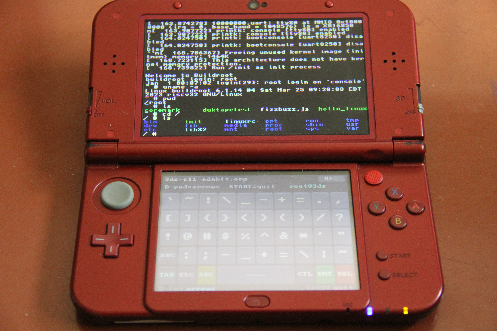

# 3DS-CLI [](https://github.com/cmdada/3DS-CLI/actions/workflows/release.yml)

Run real RISC-V Linux on a Nintendo 3DS.

3DS-CLI boots a stock RV32 Linux 6.6 kernel with a glibc userspace off your SD
card, using [mini-rv32ima-mmu](https://github.com/cmdada/mini-rv32ima-mmu), mini-rv32ima with a full Sv32 MMU, S-mode and a built-in SBI,
running as ordinary homebrew inside Horizon OS.



- Top screen is a terminal (ANSI/xterm, 24-bit colour, zoom, panning). Bottom
  screen is a touch keyboard.
- Writes go straight to `rootfs.ext2` on the SD card. No save step, and nothing
  is lost if the battery dies.
- Networking over the console's WiFi. `wget`, `ssh` and `ntpd` all work.
- The guest gets real hardware: SD card, NAND, battery, sensors, sliders,
  cameras, mic, speakers.
- Comes with bash, vim, nano, htop, tree, wget, dropbear, BusyBox.
- Runs on Old 3DS and New 3DS.

## Install

**Universal Updater**: find 3DS-CLI in
[the app](https://db.universal-team.net/3ds/3ds-cli) and it does the rest.

**Manual**, from the latest release zip:

1. Copy `3ds-cli.3dsx` to `sdmc:/3ds/` and `Image` to the root of the SD card.
   The rootfs is bundled inside `Image`, so that's everything.
2. Launch it from the Homebrew Launcher. First boot is slower because it
   unpacks the rootfs to `sdmc:/rootfs.ext2`.
3. Log in as `root` with a blank password.

Delete `rootfs.ext2` to reset everything. It gets recreated next boot.

## Controls

| Button | Action |
|---|---|
| **L** / **Y** | Zoom out |
| **R** / **X** | Zoom in |
| **ZL** | Toggle auto-follow cursor |
| **ZR** | Toggle font (8x8 / 5x7 compact) |
| **Circle Pad** | Pan the viewport (turns off auto-follow) |
| **D-Pad** | Arrow keys |
| **START** | Quit to the Homebrew Launcher |

| Key | Action |
|---|---|
| **SHF** | Shift (uppercase) |
| **?#1** / **#+=** | Symbol layers |
| **ABC** | Back to letters |
| **CTL** | Ctrl modifier. Tap CTL, then a letter |
| **TAB** / **ESC** / **ENT** / **DEL** | Tab, escape, enter, backspace |

## Hardware passthrough

The console shows up under `/mnt/3ds`:

```
sd     the real SD card, read-write
nand   CTR NAND, read-only
twl    TWL NAND, read-only
hw     sensors, power, camera, mic, speakers
```

`sd` is the same card the Homebrew Launcher reads, so it's the easiest way to
get files in and out. `nand` and `twl` need Luma3DS extended homebrew
permissions. Without those they just don't show up.

`hw` is just files:

```sh
cat /mnt/3ds/hw/battery                          # 87
cat /mnt/3ds/hw/accel                            # 12 -4 251   (x y z)
cat /mnt/3ds/hw/info                             # summary of everything
echo "info 255 0 0" > /mnt/3ds/hw/leds           # notification LED (R G B)
cat /mnt/3ds/hw/camera_outer.rgb565 > shot.raw   # one 400x240 RGB565 frame
dd if=/mnt/3ds/hw/mic.pcm of=rec.pcm count=100   # signed 16-bit mono, 16kHz
cat music.pcm > /mnt/3ds/hw/audio.pcm            # signed 16-bit stereo, 32730Hz
```

There's also `charging`, `gyro`, `slider_3d`, `slider_volume`, `model`,
`firmware`, `region`, `language`, `steps`, `wifi`, `shell`, `adapter` and
`battery_voltage`. The sensors show up on `/dev/input/event0` as evdev axes
too.

`mic.pcm` never hits EOF, so read it with `dd count=…` instead of `cat`.
Grabbing a camera frame freezes the guest for up to a second.

## Networking

If the 3DS is on WiFi, the guest gets a DHCP lease on `10.0.2.0/24` and
outbound TCP/UDP/DNS goes out through the console. Homebrew can't open raw
sockets, so `ping` only answers from the gateway (`10.0.2.2`), and nothing can
connect in.

## Notes

Guest RAM is whatever the app can get from the 3DS heap: about 54MB on a New
3DS, about 20MB on an Old 3DS. There's another 64MB of swap on
`sdmc:/swap.img`. An Old 3DS has no spare CPU core so it's slower, and the app
drops the UI to ~8fps to leave more for Linux. The first line of the boot log
tells you which model it detected.

If you get `Image too large for RAM`, your `Image` and `3ds-cli.3dsx` are from
different releases. Update both.

## Building

Needs devkitPro with devkitARM and libctru.

```sh
make        # 3ds-cli.3dsx
make cia    # also 3ds-cli.cia (needs bannertool + makerom)
make dtb    # regenerate the device tree after editing source/3ds-cli.dts
```

The kernel and rootfs are built with the Buildroot tree in `buildroot/`:

```sh
wget https://buildroot.org/downloads/buildroot-2024.02.9.tar.gz
tar xf buildroot-2024.02.9.tar.gz && cd buildroot-2024.02.9
make BR2_EXTERNAL=../buildroot O=../out 3ds_defconfig
make O=../out
cd .. && python3 tools/mkimage.py out/images/Image out/images/rootfs.ext4 Image
```

Kernel config is `buildroot/board/3ds-cli/linux.config`. Packages are in
`buildroot/configs/3ds_defconfig`. You can also just put a plain kernel `Image`
and a separate `rootfs.ext2` on the SD card, which is easier while iterating.

## Star History

<a href="https://www.star-history.com/?repos=cmdada%2F3ds-cli&type=date&legend=top-left">
 <picture>
   <source media="(prefers-color-scheme: dark)" srcset="https://api.star-history.com/chart?repos=cmdada/3ds-cli&type=date&theme=dark&legend=top-left" />
   <source media="(prefers-color-scheme: light)" srcset="https://api.star-history.com/chart?repos=cmdada/3ds-cli&type=date&legend=top-left" />
   
 </picture>
</a>

## Credits

- Built with [devkitARM / libctru](https://github.com/devkitPro/libctru)
- Powered by [mini-rv32ima-mmu](https://github.com/cmdada/mini-rv32ima-mmu), a
  fork of [mini-rv32ima](https://github.com/cnlohr/mini-rv32ima) by cnlohr

## License

GPL-3.0. See [LICENSE](LICENSE).
